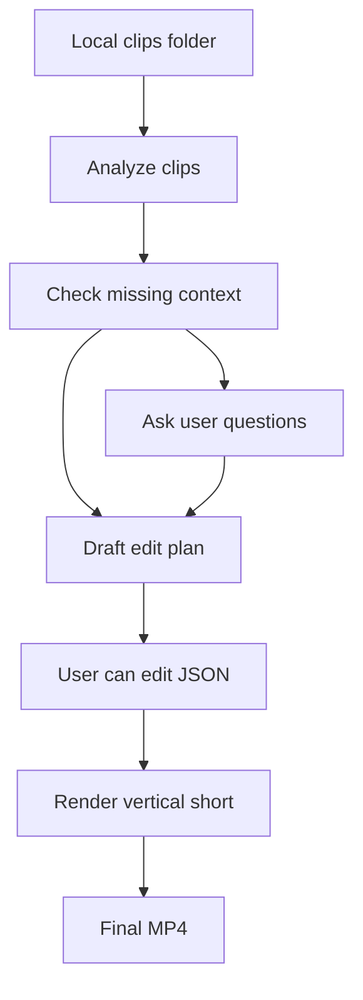

# AI Shorts Editor Product Spec

## Summary

AI Shorts Editor is a local CLI-first product for turning food and travel video clips into short-form vertical videos. The MVP takes a folder of raw clips, analyzes what is happening in each clip, asks the user for missing context when needed, generates editable project artifacts, and renders a 30-45 second short suitable for Instagram Reels or TikTok.

The first version optimizes for aesthetic b-roll: visually strong clips, high-energy pacing, tasteful overlays, optional narration, and a workflow that can produce a usable creative first draft without a timeline editor.

## Target User

The first user is a creator or builder with a folder of food/travel clips who wants a quick first draft without manually reviewing every second of footage.

They are comfortable running a local CLI and editing generated JSON files. They should not need a full video editor to use the MVP.

## Problem

Food and travel creators often capture many short clips, but turning them into a polished short is slow because they need to review footage, identify the best moments, choose an order and rhythm, add captions or overlays, and render for vertical social platforms.

The MVP compresses that work into an AI-assisted local pipeline where the system handles analysis and first-pass editing, while the human supplies missing context and can tweak intermediate JSON artifacts.

## Goals

- Generate a usable first-draft short from a local folder of clips.
- Prioritize visual quality, pace, and aesthetic variety over complex narrative structure.
- Produce transparent intermediate artifacts that can be manually edited and rerun.
- Ask clarifying questions before rendering when important context is missing.
- Keep the first version local, repeatable, and cost-conscious.

## Non-Goals

- No hosted backend, user accounts, or cloud storage in the MVP.
- No full web app or timeline editor UI.
- No analytics-driven learning loop.
- No multi-format publishing workflow.
- No assumption that the first VLM schema is final.

## Inputs

The MVP input is a local folder of source videos. Each clip is expected to be roughly 10-60 seconds long.

Optional metadata may include destination, restaurant/place name, trip context, vibe, creator notes, target platform, or must-use/must-avoid clips. If metadata is not provided, the system may infer what it can from filenames, media metadata, and VLM analysis.

When the system does not have enough context to make a good creative decision, it should ask the user before rendering.

## Output

- Format: vertical 9:16, default 1080x1920.
- Duration: 30-45 seconds.
- Style: aesthetic b-roll, fast-paced, visually polished, UGC-friendly.
- Audio: useful without TTS; optional AI voiceover can be generated later in the pipeline.
- Text: captions or punchy overlays driven by the edit plan and optional script.
- Render: final `.mp4` plus editable JSON artifacts.

## User Workflow

1. User creates a local project from a folder of clips.
2. System probes media files and analyzes clips with a VLM.
3. System summarizes what it found and checks for missing context.
4. System asks clarifying questions when context is required.
5. System generates an editable edit plan.
6. User optionally edits JSON artifacts.
7. System renders a vertical short from the edit plan.
8. User can tweak JSON and rerender without repeating expensive analysis.

## Product Flow

## Local Project Artifacts

Each project should be stored in a local folder with inspectable files. The exact schema can evolve, but the product should preserve these artifact categories:

- Clip analysis: VLM observations for each source clip.
- Project context: user-provided answers and inferred metadata.
- Edit plan: ordered source segments, timestamps, crop/framing, pacing, overlays, and audio intent.
- Optional voiceover script: narration lines and timing intent.
- Optional captions or overlays: display text and timing.
- Render output: final `.mp4` and any render logs.

## Core Requirements

### Local CLI

The MVP runs locally from the command line. It should not require cloud storage, accounts, or a hosted service to produce a short.

### Editable Artifacts

The system should persist intermediate JSON artifacts. A user should be able to edit generated files and rerun later stages without repeating expensive VLM analysis.

### VLM Analysis

The VLM should identify what is happening in each source clip and provide enough structure for the orchestrator to choose useful moments. TwelveLabs Pegasus is a candidate provider, but the product should keep the analysis layer provider-adaptable until timestamp precision and output quality are validated.

### Orchestration

The orchestrator should choose source clips and timestamp ranges that maximize visual quality, high-energy pacing, aesthetic variety, and a coherent enough food/travel sequence.

The edit plan should include source video paths, start/end timestamps, order, duration, crop/framing assumptions, overlays, captions, and optional voiceover intent.

### Clarifying Questions

The system should ask questions before rendering when important context is missing. Good clarification prompts include:

- Where was this filmed?
- Is this a restaurant, city guide, trip recap, or general aesthetic montage?
- Should there be voiceover?
- What vibe should the edit have?
- Are there any must-use or must-avoid clips?

### Rendering

Rendering should use Remotion. The first render template should treat the edit plan as the source of truth and support vertical b-roll, fast cuts, basic crop/zoom behavior, text overlays, captions, and optional voiceover.

## Success Criteria

The MVP succeeds when:

- A user can create a local project from a folder of food/travel clips.
- The system can analyze clips and produce an inspectable analysis artifact.
- The system can ask clarifying questions when it lacks essential context.
- The system can generate an editable edit plan using source videos and timestamps.
- The user can tweak JSON and rerun rendering without restarting the whole pipeline.
- The system can render a 30-45 second vertical short that feels like a plausible TikTok/Reels first draft.
- Runs are fast and cheap enough to iterate on repeatedly.

## Open Product Questions

- How much original clip audio should be preserved in aesthetic b-roll mode?
- Should captions be treated as subtitles, punchy text overlays, or both?
- Should music selection be part of MVP, or should the first version assume a provided background track?
- Should crop/framing be automatic only, or editable per segment in the edit plan?
- What minimum VLM timestamp precision is good enough for selecting usable moments?
